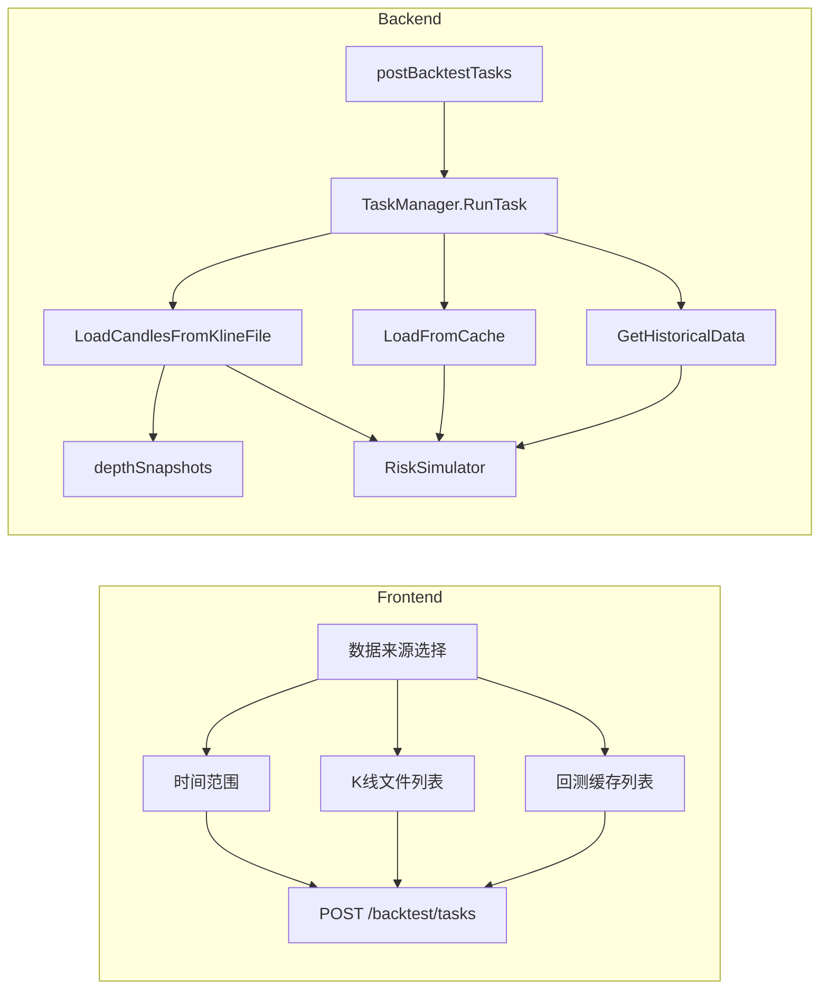

# 回测支持 K 线文件与订单深度风控

## 现状简述

- **数据来源**：回测仅支持「交易所 + 交易对 + 周期 + 时间范围」，后端通过 [backtest.GetHistoricalData](backtest/data_fetcher.go) 拉取（优先读 backtest 缓存，再拉 Binance）。
- **任务模型**：[BacktestTask](backtest/task.go) 含 symbol、interval、start_time、end_time；[TaskManager.RunTask](backtest/task_manager.go) 固定用 `GetHistoricalData(task.Symbol, task.Interval, task.StartTime, task.EndTime)` 取 K 线。
- **K 线文件**：[KlineCollector](monitor/kline_collector.go) 在 `./data/kline` 下写 CSV；1m/1h 为带深度格式（26 列：OHLCV + 5 档 bid/ask price+qty），tick 为无深度；[listKlineFiles](web/api_kline_files.go) 已返回 `has_depth`。
- **回测缓存**：`backtest/cache/{cacheKey}.csv` 仅 7 列 OHLCV，[ListCache](backtest/cache_manager.go) 返回 name/symbol/interval/start/end；前端已有「K 线缓存」Tab 展示列表，但无法选某条缓存直接跑回测。
- **风控**：[RiskSimulator](backtest/risk_simulator.go) 仅做「成交量异常 + 价格低于均线」；实盘深度风控在 [safety.DepthMonitor](safety/depth_monitor.go)（MinDepthUSDT、DropThreshold），回测未用深度。

## 目标

1. **数据来源二选一**：左侧既可「选 K 线种类 + 时间范围」（现有），也可「选一个 K 线文件」或「选一个回测缓存」直接回测。
2. **带深度文件**：当数据来自带 `has_depth` 的 CSV 时，回测自动启用「订单簿深度风控」（逻辑对齐 DepthMonitor：深度不足或骤降时跳过买入）。

---

## 1. 后端：数据层与任务模型

### 1.1 任务与存储扩展

- **[backtest/task.go](backtest/task.go)**  
  - 在 `BacktestTask` 中增加可选字段（保持兼容）：  
    - `DataSource string`：`"time_range"`（默认）| `"kline_file"` | `"cache"`  
    - `KlineFile string`：KlineCollector 文件名（如 `1m_binance_BTCUSDT_20260102.csv`）  
    - `CacheName string`：回测缓存 key（与 [ListCache](backtest/cache_manager.go) 的 `Name` 一致）
- **[storage](storage/backtest_task.go)**  
  - 表 `backtest_tasks` 增加可空列：`data_source`、`kline_file`、`cache_name`。  
  - `CreateBacktestTask` / `GetBacktestTask` / `ListBacktestTasks` / `UpdateBacktestTaskStatus` 读写上述字段（未设时保持 null/空）。

### 1.2 从文件/缓存加载 K 线

- **backtest 包内新增「文件/缓存」加载**（可放在 [backtest/data_fetcher.go](backtest/data_fetcher.go) 或新文件如 `data_source.go`）：  
  - **从 KlineCollector 文件加载**  
    - 入参：`dataDir string`（如 `./data/kline`）、`filename string`。  
    - 读 CSV：若列为 7（与现有 cache 格式一致），用现有 `parseCSVRecord` 得到 `[]*exchange.Candle`；若列为 26（带深度），前 6 列解析为 Candle，后 20 列解析为每根 K 线的 5 档买卖深度。  
    - 返回：`candles []*exchange.Candle`，以及可选 `depthSnapshots []*DepthSnapshotForBacktest`（与现有 [DepthSnapshot](safety/depth_monitor.go) 语义对齐：每根 K 线对应一个总深度等，便于风控判断）。  
    - 26 列格式与 [saveKlineWithDepthToCSV](monitor/kline_collector.go) 一致：timestamp, open, high, low, close, volume, bid_price_1, bid_qty_1, ask_price_1, ask_qty_1, … , ask_price_5, ask_qty_5。
  - **从回测缓存按名称加载**  
    - 入参：`cacheName string`。  
    - 直接调用现有 `LoadFromCache(cacheName)`，返回 `[]*exchange.Candle`（当前缓存无深度，depthSnapshots 为 nil）。
- **文件元信息**：从 KlineCollector 文件名解析 symbol/interval/日期（已有 [parseFilename](monitor/kline_collector.go) 逻辑）；从 [cache_index](backtest/cache_manager.go) 可读 symbol/interval/start/end。用于回测任务展示与 GET klines 时一致化。

### 1.3 回测任务执行时数据分支

- **[backtest/task_manager.go](backtest/task_manager.go)**  
  - **依赖注入**：TaskManager 需能解析「K 线文件」路径：在 main 层将 KlineCollector 的 `GetDataDir()` 或等价 dataDir 注入 TaskManager（或通过 web 层传参），以便 `LoadCandlesFromKlineFile(dataDir, task.KlineFile)` 能读到 `./data/kline/<filename>`。  
  - **RunTask 分支**：  
    - 若 `task.DataSource == "kline_file"` 且 `task.KlineFile != ""`：用上述 `LoadCandlesFromKlineFile` 得到 candles（及可选的 depthSnapshots）；symbol/interval/start/end 从文件名或文件首尾行时间推导，写回 task 用于存储与报告。  
    - 若 `task.DataSource == "cache"` 且 `task.CacheName != ""`：用 `LoadFromCache(task.CacheName)` 得到 candles；symbol/interval/start/end 从 cache 元数据读取并写回 task。  
    - 否则：保持现有 `GetHistoricalData(task.Symbol, task.Interval, task.StartTime, task.EndTime)`。
  - **深度风控**：当 `depthSnapshots != nil` 且长度与 candles 一致时，使用「带深度的 RiskSimulator」逻辑（见下节）；否则沿用现有仅成交量+价格的 RiskSimulator。

### 1.4 订单深度风控接入回测

- **backtest 包内定义「回测用深度快照」**（可与 safety.DepthSnapshot 对齐字段，避免循环依赖即可）：例如每根 K 线一个结构体，含该时刻总深度（USDT）、可选买卖比例等，供风控判断。  
- **[backtest/risk_simulator.go](backtest/risk_simulator.go)**  
  - **RiskSimulatorConfig** 增加可选深度参数：如 `MinDepthUSDT`、`DepthDropThreshold`（与 [DepthMonitor 配置](safety/depth_monitor.go) 语义一致）。  
  - **RiskSimulator** 增加可选入参：`depthSnapshots []*...`（与 candles 一一对应）。  
  - **Check(candles, candleIndex)**：在现有「成交量+价格」逻辑之外，若提供了 depthSnapshots 且配置了深度参数，则：  
    - 当前 K 线深度 &lt; MinDepthUSDT → 触发风控（跳过买入）；  
    - 当前深度相对近期平均下降比例 ≥ DepthDropThreshold → 触发风控；  
    - 恢复条件与 DepthMonitor 类似（深度回升到阈值以上）。
  - 这样，当数据来自「带深度的 CSV」时，TaskManager 构造带深度配置的 RiskSimulator 并传入 depthSnapshots；当数据来自时间范围或无深度缓存时，depthSnapshots 为 nil，行为与现在一致。

---

## 2. 后端：API 与路由

### 2.1 创建回测任务

- **[web/api_backtest.go](web/api_backtest.go) postBacktestTasks**  
  - 请求体在现有字段基础上增加可选：`data_source`、`kline_file`、`cache_name`。  
  - 校验：  
    - 若 `data_source == "kline_file"`：`kline_file` 必填；可校验该文件在 KlineCollector 列表中存在（或由 TaskManager 加载时再报错）。  
    - 若 `data_source == "cache"`：`cache_name` 必填。  
    - 若 `data_source == "time_range"` 或未传：保持现有 `start_time`/`end_time`/`symbol`/`interval` 必填。
  - 写入 `BacktestTask` 的 DataSource、KlineFile、CacheName；若为文件/缓存，symbol/interval/start_time/end_time 可由后端在 RunTask 中从文件/缓存元数据补全后再持久化（或允许前端传占位，后端覆盖）。

### 2.2 获取任务 K 线（报告用）

- **getBacktestTaskKlines**  
  - 若任务存在 `kline_file` 或 `cache_name`：从对应文件/缓存读取 K 线序列，按当前 API 返回格式（klines + symbol + interval）返回，**不再**按 symbol/interval/start/end 去拉交易所或缓存键。  
  - 否则：维持现有逻辑（按 task 的 symbol/interval/start/end 取数据）。

### 2.3 依赖注入

- main 中创建 TaskManager 时传入 KlineCollector 的 dataDir（或能解析 kline 文件路径的接口），以便 RunTask 能调用 `LoadCandlesFromKlineFile(dataDir, task.KlineFile)`。

---

## 3. 前端：回测页「数据来源」与提交

### 3.1 数据来源选择

- **[webui/src/components/BacktestMenu.tsx](webui/src/components/BacktestMenu.tsx)** 在「1. 交易对与数据」卡片内：  
  - 增加 **数据来源** 单选项：`时间范围` | `K线文件` | `回测缓存`（默认「时间范围」）。  
  - **时间范围**：保留现有交易所、市场类型、交易对、回测天数、K 线周期、开始/结束日期、「生成 K 线缓存」等。  
  - **K线文件**：  
    - 调用现有 [listKlineFiles](webui/src/services/klineFiles.ts) 获取列表；  
    - 展示表格或下拉：文件名、symbol、interval、has_depth、修改时间等；  
    - 用户选择一项后，记录 `selectedKlineFile`（filename）。  
    - 提交时不再要求选交易对/日期，symbol/interval 由后端从文件解析。
  - **回测缓存**：  
    - 使用现有「K 线缓存」Tab 的 [cachedKlines](webui/src/components/BacktestMenu.tsx)（来自 listCache）；  
    - 在「新建回测」里当数据来源=回测缓存时，展示该列表并选择一条，记录 `selectedCacheName`（cache name）；  
    - 提交时传 cache_name，symbol/interval/start/end 由后端从缓存元数据得到。

### 3.2 提交与校验

- **handleRunBacktest**：  
  - 若数据来源为「时间范围」：校验 symbol、interval、startDate、endDate、策略、总资金；`postBacktestTask` 传 `start_time`、`end_time`、`symbol`、`interval` 等（与现有一致），可不传或传 `data_source: "time_range"`。  
  - 若为「K线文件」：校验已选 `selectedKlineFile`、策略、总资金；传 `data_source: "kline_file"`, `kline_file: selectedKlineFile`。  
  - 若为「回测缓存」：校验已选 `selectedCacheName`、策略、总资金；传 `data_source: "cache"`, `cache_name: selectedCacheName`。
- **[webui/src/services/backtest.ts](webui/src/services/backtest.ts) postBacktestTask**：  
  - 参数类型增加可选：`data_source?: string`、`kline_file?: string`、`cache_name?: string`，并在请求体中带上。

---

## 4. 数据流小结（可选 Mermaid）

---

## 5. 实现顺序建议

1. **backtest**：扩展 BacktestTask 结构体；实现 LoadCandlesFromKlineFile（7 列 + 26 列）、从 CacheName 加载；定义回测用深度快照与 RiskSimulator 深度逻辑。
2. **storage**：迁移 backtest_tasks 表，读写 data_source/kline_file/cache_name。
3. **task_manager**：注入 dataDir；RunTask 内按 DataSource 分支，有深度时构造带深度参数的 RiskSimulator 并传入 depthSnapshots。
4. **web**：postBacktestTasks 接受并校验新字段；getBacktestTaskKlines 在存在 kline_file/cache_name 时从文件/缓存读 K 线；main 注入 dataDir 到 TaskManager。
5. **前端**：数据来源单选 + K 线文件列表/回测缓存选择 + 提交参数扩展与校验。

---

## 6. 风险与注意点

- **路径安全**：`KlineFile` 只接受文件名（不含路径），后端拼接 `dataDir + filename`，避免目录穿越。  
- **兼容性**：未传 `data_source` 或传 `time_range` 时行为与现有一致；旧任务 kline_file/cache_name 为空，getBacktestTaskKlines 仍按 symbol/interval/start/end 取数。  
- **深度参数**：回测深度风控的默认阈值可与配置中 `risk_control.depth_monitor` 对齐，或先在 backtest 中写死默认值，后续再接配置。

