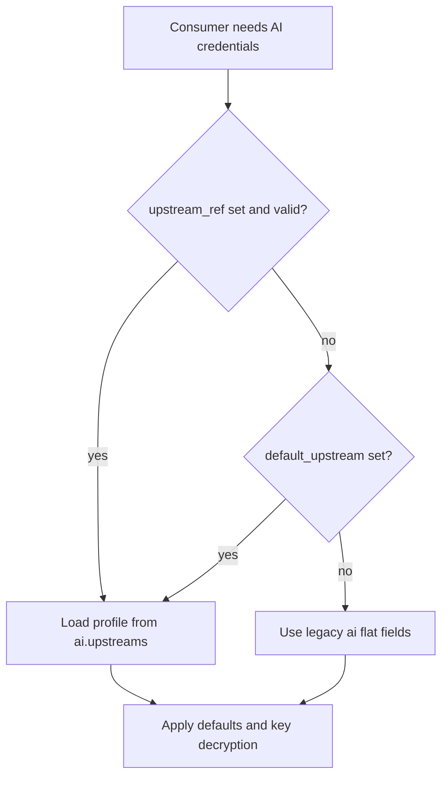

# AI 命名上游（Upstream Profiles）设计说明

本文档描述 QuantMesh 中 **多套可复用的 AI 上游配置（命名 profile）** 的目标、配置模型、解析规则与迁移方式，作为后续代码实现的蓝图。当前发行版可能尚未完全实现文中全部字段行为，以实现为准。

## 1. 目标与适用范围

### 1.1 目标

- 在单一 `config.yaml` 内维护 **多条** 互不干扰的 AI 凭证与端点（例如：办公网 OpenAI、家中 Poe、国内兼容网关）。
- 支持 **按功能** 选择上游（新闻分析、智子巡检、某 AI 子模块等），避免「全局只能填一套 key/base_url」带来的切换成本。
- **向后兼容**：未使用新能力时，行为与仅配置扁平 `ai` 字段的历史版本一致。

### 1.2 非目标（首版可不实现）

- **多上游故障转移 / 轮询**：不在首版强制实现，以免与异步任务重试、超时策略耦合；可作为后续扩展。
- **复兴已移除的 `ai.proxy.*` 等旧模型**：除非单独立项；本设计以「直连 + 可选 `base_url`」为主，与 CHANGELOG 中移除说明一致。

## 2. 术语

| 术语 | 含义 |
|------|------|
| **上游（Upstream）** | 一次 LLM 调用所指向的 provider + 端点 + 凭证组合。 |
| **Profile / 命名上游** | `ai.upstreams` 下的一个键，对应一组 `provider`、`model`、`api_key`、`base_url`。 |
| **扁平字段（Legacy flat）** | 根级 `ai.provider`、`ai.api_key`、`ai.gemini_api_key`、`ai.base_url`，与当前代码行为一致。 |
| **upstream_ref** | 某功能块声明「使用哪个 profile 名称」的字符串引用。 |
| **default_upstream** | 声明默认使用 `upstreams` 中的哪一个键作为全局默认凭证来源（可选）。 |

## 3. 现状（实现前代码事实）

以下便于对照，以仓库源码为准：

- 全局 `ai` 仅支持单组凭证与 `base_url`（见 `config/config.go` 中 `AI` 结构体）。
- `news_monitor.ai_provider` 可单独指定一套；`ApplyDefaults` 在 `api_key` 为空时从全局 `ai` 继承。
- `ai.NewAIClient(provider, model, apiKey, baseURL)` 无 profile ID；工厂支持的 `provider` 为：`gemini`、`openai`、`claude`、`poe`（见 `ai/factory.go`）。
- Web/API、任务处理等路径分散读取 `cfg.AI` 的 key，尚未统一经「解析器」。

## 4. 配置模型

### 4.1 顶层结构（建议）

```yaml
ai:
  enabled: true

  # --- 新增：命名上游（可选）---
  default_upstream: ""     # 空：见 5.2 节与扁平字段的关系

  upstreams:
    my-openai:
      provider: openai
      model: gpt-4o-mini
      api_key: "sk-..."
      base_url: ""           # 空：使用 OpenAI 默认端点

    office-poe:
      provider: poe
      model: "..."
      api_key: "..."
      base_url: "https://..."   # Poe 在工厂中要求非空 base_url

    cn-gateway:
      provider: openai
      model: "..."
      api_key: "..."
      base_url: "https://your-compatible-gateway/v1"

  # --- 保留：扁平字段（隐式 default / 兼容旧版）---
  provider: gemini
  api_key: ""
  gemini_api_key: ""
  base_url: ""
```

### 4.2 Profile 字段语义

| 字段 | 说明 |
|------|------|
| `provider` | 与工厂一致：`gemini`、`openai`、`claude`、`poe`。 |
| `model` | 模型名；空时由各调用方或 ApplyDefaults 决定默认模型（与现有逻辑对齐）。 |
| `api_key` | 密钥；支持既有加密格式时，与全局 `ai.api_key` 相同解密路径。 |
| `base_url` | 自定义 API 根地址；`openai`/`claude`/`poe` 按需使用；`poe` 必填。Gemini 当前实现可能忽略该字段，预留语义见第 7 节。 |

### 4.3 与旧「代理」配置的关系

- 历史中的 `ai.access_mode`、`ai.proxy.*` 等若已从配置结构删除，**本文档不恢复其语义**。
- 若需经 HTTP 代理访问公网，仍推荐使用环境变量（如 `HTTPS_PROXY`）或系统/容器级代理，与「命名上游」正交。

## 5. 解析规则

### 5.1 解析产物

解析器对任一「消费方」应能产出用于调用工厂的四元组（或结构体）：

`provider, model, api_key, base_url`

并保证密钥已解密（若适用）。

### 5.2 无 `upstreams` 时

- **忽略** `default_upstream`（视为未使用）。
- 行为等价于当前版本的扁平字段逻辑，包括 `gemini_api_key` 相对 `api_key` 的优先级、以及 `news_monitor.ai_provider` 在 `ApplyDefaults` 中从全局继承 key 的规则。

### 5.3 存在 `upstreams` 时

1. **`default_upstream` 非空**  
   - 必须等于 `upstreams` 中某一键。  
   - 表示：**全局默认**凭证来自该 profile（`provider`/`model`/`api_key`/`base_url`），用于替代「仅依赖扁平字段」的默认含义（具体以实现为准：可定义为扁平字段清空时完全以 profile 为准，或 profile 与扁平合并策略——**推荐**实现阶段二选一写单测锁死）。

2. **`default_upstream` 为空**  
   - **推荐约定（降低迁移摩擦）**：扁平字段 `ai.provider`、`ai.api_key`、`ai.gemini_api_key`、`ai.base_url` 仍表示 **default**，与是否定义 `upstreams` 无关；`upstreams` 仅在被 `upstream_ref` 或显式逻辑引用时使用。  
   - 若某部署只使用命名上游、不再使用扁平字段，可逐步把凭证迁入 `upstreams` 并设置 `default_upstream`，再删除敏感扁平字段。

### 5.4 `upstream_ref` 与 profile 的优先级（按功能）

当某模块配置 **`upstream_ref: "some-key"`** 且 `ai.upstreams.some-key` 存在时：

1. **优先** 使用该 profile 的四元组。  
2. **可选回退**：若 profile 中 `api_key` 为空，可定义回退到全局扁平或 `default_upstream` 指向的 profile（**推荐**在实现中只选一种策略并文档化，避免混用导致难以排查）。

当 **`upstream_ref` 未设置或为空** 时：

- 回退到 **5.2 / 5.3** 的 default 解析（扁平 + `default_upstream` 规则）。

### 5.5 解析流程图



## 6. 按功能绑定（建议字段）

以下字段在 **设计层面** 给出命名，实现可分阶段落地。

| 消费方 | 建议字段 | 说明 |
|--------|----------|------|
| 全局默认 / Web 未特指 | `ai.default_upstream` 或扁平 `ai` | 与现有 `web/api.go` 等读取全局 `ai` 的行为对齐后，再切换到解析器。 |
| `news_monitor` | `news_monitor.ai_provider.upstream_ref` | 指向 `ai.upstreams` 的键；与现有 `provider`/`model`/`api_key`/`base_url` 并存时，**建议** profile 优先，避免双处维护冲突。 |
| `inspector` | `inspector.ai.upstream_ref` | 智子巡检独立绑定上游。 |
| `ai.modules.*` | 各子模块 `upstream_ref` | 如 `market_analysis`、`risk_analysis` 等，便于不同模块用不同模型或网关。 |

## 7. 安全与可观测性

- **日志**：允许记录 `upstream` 的 **名称（id）** 与 `provider`；**禁止**明文打印 `api_key`。  
- **脱敏**：配置导出、API 返回、调试信息中对 `upstreams.*.api_key` 与扁平字段一致脱敏（如 `****`）。  
- **校验**：启动或热加载时对 `default_upstream`、`upstream_ref` 做存在性校验，失败时明确报错。

## 8. Gemini 与 `base_url`

当前 `NewGeminiProvider` 可能不消费自定义 `base_url`。设计仍允许在 profile 中保留该字段以便：

- 未来支持 Google AI 兼容代理或自建网关时统一模型；或  
- 配置校验阶段提示「当前版本忽略」。

具体行为以实现与 `CHANGELOG` 为准。

## 9. 迁移指南

### 9.1 仅使用扁平字段的用户

无需改动；未配置 `upstreams` 时行为不变。

### 9.2 引入多上游

1. 在 `ai.upstreams` 下添加各环境 profile。  
2. （可选）设置 `ai.default_upstream` 指向常用 profile。  
3. 在需要的模块设置 `upstream_ref`。  
4. 确认无重复密钥分散在「扁平 + profile」两处导致误解；迁移完成后可缩小扁平字段中的敏感信息。

### 9.3 与 `news_monitor.ai_provider` 的关系

现有内联 `ai_provider` 仍可作为单模块专用配置；引入 `upstream_ref` 后，推荐 **要么** 全用内联 **要么** 全用引用，减少合并歧义。

## 10. FAQ

**Q: `default_upstream` 与扁平字段同时存在谁优先？**  
A: 推荐策略见 5.3：若 `default_upstream` 非空，则全局默认以该 profile 为准；若为空且存在 `upstreams`，仍以扁平为 default。实现必须用测试固定一种行为。

**Q: 是否支持同一 profile 被多处引用？**  
A: 支持；这正是命名上游的目的。

**Q: Poe 忘记写 `base_url` 会怎样？**  
A: 工厂会报错（与现版一致）；配置校验宜提前提示。

**Q: 会与异步任务重试冲突吗？**  
A: 上游解析应发生在任务执行前或请求构造时；故障转移若未来要做，需单独设计，不与简单重试混为一谈。

## 11. 实现对照清单（供开发 PR）

实现时可按下列顺序推进，并更新 `CHANGELOG` 与版本号（遵循项目发版规范）。

1. `config.Config` 增加 `default_upstream`、`upstreams` 映射类型。  
2. `ApplyDefaults`、`DecryptAPIKey`、`SanitizeConfig` 覆盖新字段。  
3. 新增 `ResolveAIUpstream(ref string) (…)` 或等价函数，集中四元组解析。  
4. 替换 `main` / `web` / `monitor` 等分散读取处，改为经解析器（含 `GeminiNewsAnalyzer` 构造路径）。  
5. `config_test.go` 覆盖边界：无 `upstreams`、仅有 `upstreams`、`default_upstream` 非法、`upstream_ref` 不存在等。  
6. WebUI `config.ts` 与表单、i18n 文案。  

---

## 参考

- [新闻监控系统集成指南](news_monitor_integration.md)（含 AI 上游小节链接）
- [配置指南](CONFIGURATION_GUIDE.md)

<!-- quantmesh usage beacon -->

