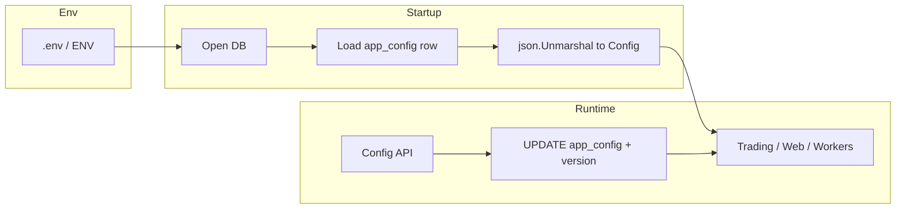

# 主配置数据库化 — 设计文档

> **文档用途**：指导后续实现与评审；实现阶段再拆任务。  
> **非目标（本文不展开）**：交易所 API Key / Secret 的加解密与密钥轮换（保持与现有 [`LoadConfig`](../config/config.go) 行为一致即可，或后续单独立项）。

---

## 1. 背景与目标

### 1.1 现状（代码事实）

- 主配置以 **YAML 文件** 为中心：[`LoadConfig`](../config/config.go) / [`SaveConfig`](../config/config.go)，路径常为 `config.yaml`（亦见 [`web/api_config.go`](../web/api_config.go)、[`web/api_capital.go`](../web/api_capital.go) 等）。
- 配置体为大型嵌套结构 [`config.Config`](../config/config.go)，含 **map**（如 `exchanges`）、**切片**（如 `SymbolConfig.Strategies`、`RocketTieredGridConfig.Tiers`）、**不定长列表**等。
- 已有 **SQLite `system_settings`**：`key / value / type`，支持 JSON 读写（见 [`storage/system_settings.go`](../storage/system_settings.go)）。
- 已有 **「数据库覆盖 YAML」** 模式：价差监控等用 JSON blob 存 key，运行时合并（见 [`web/api_basis_config.go`](../web/api_basis_config.go) 中 `basis_monitor_config`）。

### 1.2 目标

- **去掉对磁盘 `config.yaml` 的依赖**（生产环境）：应用配置以 **数据库为权威来源（SSOT）**。
- **连接信息**（数据库路径/URL 等）放在 **`.env` 或环境变量**，保证进程能先连库再读配置。
- **每次配置变更** 表现为对库中 **受版本约束的配置文档** 的更新（见第 4 节），而非散落无数无关联的字符串 key。
- **迁移**：首次切换时能将 **既有 `config.yaml` 全量导入** 数据库，且 **可重复执行、幂等**（见第 7 节）。

---

## 2. 设计原则

| 原则 | 说明 |
|------|------|
| SSOT | 运行时仅信任一份「主配置文档」；避免 YAML 与 DB 长期双写双读。 |
| 结构保持 | 仍以现有 `config.Config`（JSON 标签）为序列化形状，减少业务层分叉。 |
| 数组与不定长 | **不要用「每个叶子一行」的纯 KV** 表达深层数组；用 **JSON 子树或整文档**（见第 4 节）。 |
| 与 `system_settings` 共存 | 现有按 key 存的小块 JSON（如 `basis_monitor_config`）可 **逐步收敛** 到主文档，或过渡期 **读时合并**（见第 6 节）。 |

---

## 3. 目标架构

- **`.env`**：仅承载 **连接与启动必需项**（例如 SQLite 文件路径、或未来 Postgres DSN；与现有 [`main.go`](../main.go) 存储初始化方式对齐）。
- **数据库**：存 **主配置 JSON 文档** + **版本/校验**；可选存 **历史快照** 供回滚与审计。

---

## 4. 数据模型（推荐）

### 4.1 主表：`app_config`（名称可调整）

建议单列大 JSON（与现有 `Config` 对齐），避免把 `symbols[]`、`tiers[]`、`strategies[]` 拆成关系表（除非未来有多租户报表需求）。

| 字段 | 类型 | 说明 |
|------|------|------|
| `id` | INTEGER PK | 固定 `1` 单例行，或 UUID |
| `schema_version` | INTEGER | 配置模式版本，用于迁移与兼容 |
| `content` | TEXT/JSON | **整份** `config.Config` 的 JSON 序列化 |
| `revision` | INTEGER | 乐观锁：每次成功写入 +1 |
| `content_hash` | TEXT 可选 | SHA-256，便于比对与备份校验 |
| `updated_at` | TIMESTAMP | 更新时间 |

**数组 / 不定长**：全部放在 `content` 的 JSON 内（例如 [`SymbolConfig`](../config/config.go) 的 `Strategies []StrategyInstance`、`RocketTieredGrid.Tiers`）。  
**「每次变更一个 key」的语义**：实现层应支持两类操作（可同时提供）：

1. **整包替换**：PUT 整个 `content`（前端或运维最省事，需带 `revision` 防并发覆盖）。
2. **子路径 PATCH**：对 JSON Pointer 或点路径如 `basis_monitor` / `symbols` 更新 **一个子树**；数组字段以 **整段数组** 为值原子替换，避免 `symbols[0]`、`symbols[1]` 拆行。

### 4.2 可选表：`app_config_history`

用于审计与回滚：`revision`、`content`、`operator`、`created_at`。非首版必需，但交易类系统 **强烈建议**。

### 4.3 与现有 `system_settings` 的关系

- **过渡期**：读配置时顺序可为：`content` 主文档 → 再应用 `system_settings` 中仍存在的遗留 key（与当前 `GetEffectiveConfig` 思路一致）。
- **终态**：将 `basis_monitor_config` 等迁入主文档字段，删除重复 key，避免两处修改。

---

## 5. 配置模式版本 `schema_version`

- 与 **应用版本** 解耦：仅表示 **JSON 形状** 演进。
- 升级步骤：读库 → 若 `schema_version < N`，在内存中补默认值或跑迁移函数 → 写回 `schema_version=N`。
- 与 [`cfg.Validate()`](../config/config.go) 配合：加载后仍走现有校验，保证业务规则一致。

---

## 6. 运行时加载顺序（建议）

1. 解析环境变量，打开存储（与当前 [`storage`](../storage/sqlite.go) 一致）。
2. 读取 `app_config`；若 **无行或为空**，进入 **迁移或默认**（第 7 节）。
3. `json.Unmarshal` → `*config.Config`；必要时执行 **解密占位**（非本文范围时仍可调现有 `LoadConfig` 内解密逻辑，或加载后单独对 `Exchanges` 走同一套函数）。
4. `Validate()`。
5. 若仍存在 `system_settings` 覆盖项，按模块 **合并**（过渡期），与 [`BasisMonitorController.GetEffectiveConfig`](../web/api_basis_config.go) 同模式。

---

## 7. 从 `config.yaml` 迁移

**触发条件**（示例）：`app_config` 为空且检测到 `CONFIG_PATH` 指向的 yaml 存在，或显式子命令 `quantmesh migrate-config`。

**步骤**：

1. `yaml.ReadFile` → 已有逻辑可用 **与 `LoadConfig` 相同** 的解析路径得到 `*Config`（含解密若启用）。
2. `json.Marshal(cfg)` → 写入 `app_config`（`schema_version` 初始为 1，`revision=1`）。
3. **幂等**：若 `app_config` 已有 `revision>0` 且非 `FORCE`，则跳过或仅校验 hash。
4. **归档**：将原 `config.yaml` 重命名为 `config.yaml.imported.<timestamp>.bak`（或移入 [`config/backup`](../config/backup.go) 同类目录），避免双源。

**多 Bot 目录** [`config/bot_config.go`](../config/bot_config.go)：`bots/{id}/config.yaml` 是否一并入库属 **产品决策**；文档建议：**主配置先进 `app_config`**，Bot 级文件可作为 Phase 2 或继续文件，避免首版范围爆炸。

---

## 8. 写路径与 API 行为

- **Web/API**：现有 [`SaveConfig` 写文件](../web/api_config.go) 改为 **写 `app_config` + revision 检查**；导出/下载仍可 **序列化为 YAML 字符串** 供人读，而不作为 SSOT。
- **并发**：客户端带 `revision`；不匹配则 `409 Conflict`。
- **热更新**：保存成功后广播内部事件或依赖现有配置重载钩子（实现时对照 `main` 与 web 层已有 reload 点）。

---

## 9. 开发与灾备

- **本地无 DB**：可选 `CONFIG_JSON_FILE` 指向单文件 JSON，仅开发用；生产禁用或只读。
- **备份**：定期导出 `app_config` JSON；与现有配置备份策略对齐 [`config/backup.go`](../config/backup.go)。

---

## 10. 风险与缓解

| 风险 | 缓解 |
|------|------|
| 大 JSON 单次写入失败 | 事务 + 先写 history 再切换当前指针（若采用双表） |
| 双源（YAML+DB） | 迁移后明确禁用从 YAML 加载（除 migrate 命令） |
| 与现有 `system_settings` 重复 | 过渡期合并规则文档化；终态收敛 key |

---

## 11. 实现阶段划分（供排期，非本文细节）

- **Phase A**：`app_config` 表 + 启动从 DB 读 + CLI/API 写 + 迁移命令。
- **Phase B**：替换所有 [`SaveConfig(..., config.yaml)`](../web/api_capital.go) 调用点；前端配置页对接 revision。
- **Phase C**：收敛 `system_settings` 中与主配置重复的 JSON key；清理文档与示例。

---

## 12. 文档位置

本文档路径：`docs/config-database-design.md`（与 `docs/examples/` 下的示例配置并列）。
