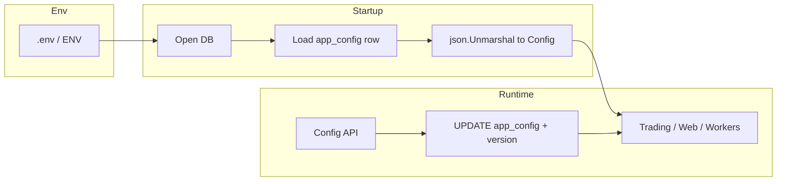
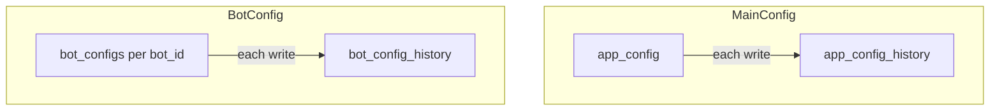

# 主配置数据库化 — 设计文档

> **文档用途**：指导后续实现与评审；实现阶段再拆任务。  
> **非目标（本文不展开）**：交易所 API Key / Secret 的加解密与密钥轮换（保持与现有 [`LoadConfig`](../config/config.go) 行为一致即可，或后续单独立项）。

---

## 1. 背景与目标

### 1.1 现状（代码事实）

- 主配置以 **YAML 文件** 为中心：[`LoadConfig`](../config/config.go) / [`SaveConfig`](../config/config.go)，路径常为 `config.yaml`（亦见 [`web/api_config.go`](../web/api_config.go)、[`web/api_capital.go`](../web/api_capital.go) 等）。
- 配置体为大型嵌套结构 [`config.Config`](../config/config.go)，含 **map**（如 `exchanges`）、**切片**（如 `SymbolConfig.Strategies`、`RocketTieredGridConfig.Tiers`）、**不定长列表**等。
- 已有 **SQLite `system_settings`**：`key / value / type`，支持 JSON 读写（见 [`storage/system_settings.go`](../storage/system_settings.go)）。
- 已有 **「数据库覆盖 YAML」** 模式：价差监控等用 JSON blob 存 key，运行时合并（见 [`web/api_basis_config.go`](../web/api_basis_config.go) 中 `basis_monitor_config`）。

### 1.2 目标

- **去掉对磁盘 `config.yaml` 的依赖**（生产环境）：应用配置以 **数据库为权威来源（SSOT）**。
- **连接信息**（数据库路径/URL 等）放在 **`.env` 或环境变量**，保证进程能先连库再读配置。
- **每次配置变更** 表现为对库中 **受版本约束的配置文档** 的更新（见第 4 节），而非散落无数无关联的字符串 key。
- **迁移**：首次切换时能将 **既有 `config.yaml` 全量导入** 数据库，且 **可重复执行、幂等**（见第 7 节）。
- **Bot 配置**：与主配置同期 **全部入库**（见第 4.4 节）；不再将「Bot 级 YAML」推迟到后续阶段。

### 1.3 Git 工作流（大改动）

- 本特性在 **独立功能分支**（例如 `feature/config-db-ssot`）上开发与评审，避免在 `main` 上直接堆叠大改。
- 合并前：迁移脚本幂等性、回滚路径、双写/读切换策略需评审通过后再合入。

---

## 2. 设计原则

| 原则 | 说明 |
|------|------|
| SSOT | 运行时仅信任一份「主配置文档」；避免 YAML 与 DB 长期双写双读。 |
| 结构保持 | 仍以现有 `config.Config`（JSON 标签）为序列化形状，减少业务层分叉。 |
| 数组与不定长 | **不要用「每个叶子一行」的纯 KV** 表达深层数组；用 **JSON 子树或整文档**（见第 4 节）。 |
| 与 `system_settings` 共存 | 现有按 key 存的小块 JSON（如 `basis_monitor_config`）可 **逐步收敛** 到主文档，或过渡期 **读时合并**（见第 6 节）。 |

---

## 3. 目标架构

- **`.env`**：仅承载 **连接与启动必需项**（例如 SQLite 文件路径、或未来 Postgres DSN；与现有 [`main.go`](../main.go) 存储初始化方式对齐）。
- **数据库**：存 **主配置 JSON 文档**、**每 Bot 一行配置**，以及 **首版即上线的历史表**（主配置历史 + Bot 配置历史），用于审计与回滚。

---

## 4. 数据模型（推荐）

### 4.1 主表：`app_config`（名称可调整）

建议单列大 JSON（与现有 `Config` 对齐），避免把 `symbols[]`、`tiers[]`、`strategies[]` 拆成关系表（除非未来有多租户报表需求）。

| 字段 | 类型 | 说明 |
|------|------|------|
| `id` | INTEGER PK | 固定 `1` 单例行，或 UUID |
| `schema_version` | INTEGER | 配置模式版本，用于迁移与兼容 |
| `content` | TEXT/JSON | **整份** `config.Config` 的 JSON 序列化 |
| `revision` | INTEGER | 乐观锁：每次成功写入 +1 |
| `content_hash` | TEXT 可选 | SHA-256，便于比对与备份校验 |
| `updated_at` | TIMESTAMP | 更新时间 |

**数组 / 不定长**：全部放在 `content` 的 JSON 内（例如 [`SymbolConfig`](../config/config.go) 的 `Strategies []StrategyInstance`、`RocketTieredGrid.Tiers`）。  
**「每次变更一个 key」的语义**：实现层应支持两类操作（可同时提供）：

1. **整包替换**：PUT 整个 `content`（前端或运维最省事，需带 `revision` 防并发覆盖）。
2. **子路径 PATCH**：对 JSON Pointer 或点路径如 `basis_monitor` / `symbols` 更新 **一个子树**；数组字段以 **整段数组** 为值原子替换，避免 `symbols[0]`、`symbols[1]` 拆行。

### 4.2 主配置历史表：`app_config_history`（首版必上）

每次 **`app_config` 成功提交新版本** 时，**追加一行**历史（或先插入历史再更新当前行，同一事务内完成）。

| 字段 | 类型 | 说明 |
|------|------|------|
| `id` | INTEGER PK AUTO | 自增 |
| `revision` | INTEGER | 与当时 `app_config.revision` 一致，便于对应 |
| `content` | TEXT/JSON | 该版本的完整 JSON 快照 |
| `content_hash` | TEXT 可选 | 便于去重与对账 |
| `operator` | TEXT 可选 | 操作者标识（用户 ID、API、CLI `migrate` 等） |
| `source` | TEXT 可选 | 如 `api`、`cli_migrate`、`rollback` |
| `created_at` | TIMESTAMP | 写入时间 |

回滚语义：从 `app_config_history` 选取某一 `revision` 的 `content`，写入 `app_config`（`revision` 递增），并 **再次** 向历史表追加一条（保留「谁把配置恢复到了哪一版」的审计链）。

### 4.3 Bot 配置：`bot_configs` + `bot_config_history`（首版必上）

**结论：每个 Bot 单独一条当前记录 + 独立修改历史**，与「所有 Bot 塞进主配置一个 JSON」相比：

| 方案 | 优点 | 缺点 |
|------|------|------|
| **每 Bot 一行（推荐）** | 按 `bot_id` 乐观锁；单 Bot 变更写入面小；历史按 Bot 查询清晰；列表/权限可扩展 | 需与主配置中「Bot 列表」字段保持引用一致（见下） |
| 仅主配置 JSON 内含 bots[] | 单表简单 | 大单行竞争、历史全量快照笨重、难以按 Bot 审计 |

**表 `bot_configs`（当前态，一行一 Bot）**

| 字段 | 类型 | 说明 |
|------|------|------|
| `bot_id` | TEXT PK | 与 [`BotConfig.ID`](../config/config.go) 及目录名一致 |
| `schema_version` | INTEGER | Bot 配置 JSON 形状版本（可与主配置 schema 独立演进） |
| `content` | TEXT/JSON | 单份 [`BotConfig`](../config/bot_config.go) 的 JSON |
| `revision` | INTEGER | 乐观锁，每次成功写入 +1 |
| `content_hash` | TEXT 可选 | SHA-256 |
| `updated_at` | TIMESTAMP | 更新时间 |

**表 `bot_config_history`（追加式历史）**

| 字段 | 类型 | 说明 |
|------|------|------|
| `id` | INTEGER PK AUTO | 自增 |
| `bot_id` | TEXT FK/索引 | 对应 `bot_configs.bot_id` |
| `revision` | INTEGER | 该快照对应的 `revision` |
| `content` | TEXT/JSON | 完整 `BotConfig` 快照 |
| `operator` / `source` / `created_at` | 同主配置历史 | — |

**与主配置的关系**：主配置 `config.Config` 里若仍包含 **Bot 清单/引用**（例如启用哪些 Bot、全局顺序），主配置 `app_config.content` 负责 **编排**；**每个 Bot 的参数字段以 `bot_configs` 为 SSOT**。迁移时需定义清晰规则：从旧 YAML 拆出 per-bot 行 + 主配置中仅保留 ID 列表或等价结构，避免两处重复存储同一套策略参数（实现阶段在代码层做单一写入 API，禁止手改两处）。

### 4.4 与现有 `system_settings` 的关系

- **过渡期**：读配置时顺序可为：`content` 主文档 → 再应用 `system_settings` 中仍存在的遗留 key（与当前 `GetEffectiveConfig` 思路一致）。
- **终态**：将 `basis_monitor_config` 等迁入主文档字段，删除重复 key，避免两处修改。

---

## 5. 配置模式版本 `schema_version`

- 与 **应用版本** 解耦：仅表示 **JSON 形状** 演进。
- 升级步骤：读库 → 若 `schema_version < N`，在内存中补默认值或跑迁移函数 → 写回 `schema_version=N`。
- 与 [`cfg.Validate()`](../config/config.go) 配合：加载后仍走现有校验，保证业务规则一致。

---

## 6. 运行时加载顺序（建议）

1. 解析环境变量，打开存储（与当前 [`storage`](../storage/sqlite.go) 一致）。
2. 读取 `app_config`；若 **无行或为空**，进入 **迁移或默认**（第 7 节）。
3. `json.Unmarshal` → `*config.Config`；必要时执行 **解密占位**（非本文范围时仍可调现有 `LoadConfig` 内解密逻辑，或加载后单独对 `Exchanges` 走同一套函数）。
4. 按需加载 **`bot_configs`**（按 `bot_id` 列表或全表），组装内存中的 Bot 运行时视图（与现有 `BotManager` 生命周期对齐）。
5. `Validate()`（主配置 + 各 Bot 配置）。
6. 若仍存在 `system_settings` 覆盖项，按模块 **合并**（过渡期），与 [`BasisMonitorController.GetEffectiveConfig`](../web/api_basis_config.go) 同模式。

---

## 7. 从 `config.yaml` 迁移

**触发条件**（示例）：`app_config` 为空且检测到 `CONFIG_PATH` 指向的 yaml 存在，或显式子命令 `quantmesh migrate-config`。

**步骤**：

1. `yaml.ReadFile` → 已有逻辑可用 **与 `LoadConfig` 相同** 的解析路径得到 `*Config`（含解密若启用）。
2. `json.Marshal(cfg)` → 写入 `app_config`（`schema_version` 初始为 1，`revision=1`）。
3. **幂等**：若 `app_config` 已有 `revision>0` 且非 `FORCE`，则跳过或仅校验 hash。
4. **归档**：将原 `config.yaml` 重命名为 `config.yaml.imported.<timestamp>.bak`（或移入 [`config/backup`](../config/backup.go) 同类目录），避免双源。

**Bot 目录 `bots/{bot_id}/config.yaml`**（首版即迁移）：

5. 扫描 `bots/` 下子目录（或从主配置已知的 `bot_id` 列表），对每个 `config.yaml` 执行与 `LoadConfig` 一致的解析（若 Bot 级与主配置解密策略一致则复用）。
6. 每个文件写入 **`bot_configs`** 一行（`revision=1`），并 **可选**在 `bot_config_history` 写入一条初始快照（`source=cli_migrate`），便于与后续变更统一审计。
7. **幂等**：若某 `bot_id` 在 `bot_configs` 已存在且非 `FORCE`，则跳过或仅校验 hash。
8. 归档各 `bots/{id}/config.yaml`（同主配置策略），避免双源。

**主配置与 Bot 编排**：若迁移后主 `config.Config` 内仍含「Bot ID 列表」类字段，迁移脚本应 **去重**：策略参数以 `bot_configs.content` 为准，主配置中只保留引用/顺序，避免同一参数在 `app_config` 与 `bot_configs` 两处重复（实现时由单一写入路径保证）。

### 7.1 零参与自动迁移（已实现）

目标：**用户无需手动执行** `--migrate-app-config`，在「仍使用 YAML 单机部署」的典型场景下，**首次启动**自动完成：可选生成 `.env`、自动入库、自动归档 YAML。

**二次启动（磁盘已无 `config.yaml`）**：`main` 在检测到配置文件不存在时，会按 `QUANTMESH_SQLITE_PATH`（默认 `./data/quantmesh.db`）调用 `LoadConfigFromAppConfigDBIfExists`；若库中有有效 `app_config` 快照则直接加载，否则仍创建最小化向导 `config.yaml`。

#### 建议触发条件（同时满足才自动迁移）

1. 主库已能打开（`storage` 已初始化且 `GetStorage()` 非空）。
2. `app_config` **无有效快照**（无行、或 `revision=0`、或 `content` 为空）。
3. 磁盘上存在 **`config.yaml`**（或 CLI 指定的配置文件路径），且 **`LoadConfig` 成功**（能通过 `Validate()`）。
4. 未设置 **`QUANTMESH_SKIP_AUTO_MIGRATE=1`**（供高级用户、CI、只读容器显式关闭）。
5. （可选收紧）仅当配置「可用于交易」或「非最小化向导态」时再自动迁移，避免把不完整的 `CreateMinimalConfig` 写进库；若选择「任何合法 Validate 都迁」，需在文档中说明。

#### 自动生成 `.env`（当仓库/工作目录下不存在 `.env` 时）

- **不要**把 `config.yaml` 里的 **API Key、Secret、Passphrase** 自动抄进 `.env`（避免双份明文、误提交、与加密配置策略冲突）。
- **可以**写入 **非密钥、可重复推导** 的项，便于后续「无 YAML 启动」与运维对齐，例如：
  - `QUANTMESH_DATA_DIR` 或 `QUANTMESH_SQLITE_PATH`：与当前 `cfg.Storage.Path` / `cfg.Database.DSN` 解析结果一致（SQLite 文件绝对路径或约定相对路径）。
  - `QUANTMESH_BOTS_DIR`：默认 `./bots`。
  - 注释块说明：`# 主配置已迁移至数据库，见 app_config；本文件仅作连接与路径提示`。
- 若用户 **已有** `.env`，**绝不覆盖**，只追加缺失键（可选）或完全跳过。
- 生成后建议将 `.env` 加入 `.gitignore`（若尚未忽略），并在日志中提示「已创建 .env，请勿提交密钥」。

#### 自动迁移与 YAML 归档顺序（建议同一事务/同一临界区）

1. 调用与现有一致的 **`MigrateYAMLToAppConfigDB`**（`source` 记为 `auto_startup` / `auto_migrate`）。
2. **仅当第 1 步提交成功** 后，将 **`config.yaml` 重命名** 为例如：  
   `config.yaml.migrated.<UTC时间戳>.bak`（与 [`config/backup`](../config/backup.go) 命名风格一致亦可）。
3. **可选**：对每个已导入的 `bots/<id>/config.yaml` 同样重命名为 `.migrated.<ts>.bak`，避免双源；若希望保留文件副本供人类编辑，可只改主配置、Bot 仅入库不删文件（产品二选一，须在发行说明写清）。

#### 自动迁移后的启动路径

- 下一次启动：`app_config` 已有内容 → **`ApplyAppConfigFromDBIfPresent`** 生效；磁盘上已无 `config.yaml` 时，进程应 **只依赖 DB**（或最小 bootstrap 读 `.env` 连库），不再要求 `config.yaml` 存在（与「去掉 YAML 依赖」终态一致）。

#### 风险与边界（实现时必须处理）

| 因素 | 处理建议 |
|------|----------|
| **并发双实例** | 两个进程同时「见库空」同时迁移：依赖 DB **事务 + 唯一约束/SELECT FOR UPDATE** 或迁移后二次校验；失败方重试读库。 |
| **只读文件系统 / 权限** | `.env` 或重命名 `config.yaml` 失败时：**库已写入则不回滚库**（或文档约定先 rename 再 migrate）；日志告警并提示手动处理。 |
| **Docker / 挂载** | `config.yaml` 在只读 volume 上：无法 rename → 仅入库 + 日志说明。 |
| **MySQL** | 自动生成 `.env` 时应写入 **`DATABASE_DSN`**（或项目约定变量名），与 `NewStorage` 一致；勿在 `.env` 写明文密码若用户不希望（可只写占位 + 注释）。 |
| **Git 跟踪的 config.yaml** | rename 后工作区出现「删除+未跟踪备份」；文档说明：备份文件应 **gitignore**，或用户改用 `config.local.yaml`。 |
| **迁移失败** | 事务回滚；**不** rename YAML；下次启动可重试。 |
| **用户只想暂时用 YAML** | `QUANTMESH_SKIP_AUTO_MIGRATE=1` 或 `QUANTMESH_USE_APP_CONFIG=0` 保留现有行为。 |

---

## 8. 写路径与 API 行为

**CLI / 环境变量（已实现 Phase A）**

| 变量 / 参数 | 作用 |
|-------------|------|
| `--migrate-app-config` | 将当前 `config.yaml` 与 `bots/*/config.yaml` 写入主库；已存在时需 `QUANTMESH_MIGRATE_APP_CONFIG_FORCE=1` |
| `QUANTMESH_BOTS_DIR` | 迁移时 Bot 目录，默认 `./bots` |
| `QUANTMESH_USE_APP_CONFIG=0` | 禁用启动时从 `app_config` 覆盖内存配置 |
| `QUANTMESH_MIGRATE_APP_CONFIG_FORCE=1` | 允许迁移覆盖已有 `app_config` |

- **主配置 Web/API**：现有 [`SaveConfig` 写文件](../web/api_config.go) 改为 **事务内**：`INSERT app_config_history`（上一版或新快照）→ `UPDATE app_config`（`revision` 递增）；不匹配则 `409 Conflict`（后续 Phase B）。
- **Bot 配置 API**：按 `bot_id` 更新 **`bot_configs`**，同一事务内 **`INSERT bot_config_history`**，携带客户端 `revision` 乐观锁。
- **导出/下载**：可将主配置与各 Bot 序列化为 YAML **仅供人类阅读/灾备**，不作为 SSOT。
- **热更新**：保存成功后广播内部事件或依赖现有配置重载钩子（实现时对照 `main` 与 web 层已有 reload 点）。

---

## 9. 开发与灾备

- **本地无 DB**：可选 `CONFIG_JSON_FILE` 指向单文件 JSON，仅开发用；生产禁用或只读。
- **备份**：定期导出 `app_config` JSON；**Bot** 侧导出 `bot_configs` 全表或按 `bot_id`；历史表可按保留策略归档（例如仅保留最近 N 条或按时间分区）。与现有配置备份策略对齐 [`config/backup.go`](../config/backup.go)。

---

## 10. 风险与缓解

| 风险 | 缓解 |
|------|------|
| 大 JSON 单次写入失败 | 事务 + 先写 history 再更新当前行 |
| 双源（YAML+DB） | 迁移后明确禁用从 YAML 加载（除 migrate 命令） |
| 与现有 `system_settings` 重复 | 过渡期合并规则文档化；终态收敛 key |
| 主配置与 `bot_configs` 参数重复 | 编排 vs 参数 SSOT 边界写清；代码层单一写入 API |
| 历史表膨胀 | 保留策略（条数/天数）、可选 VACUUM/离线归档 |

---

## 11. 实现阶段划分（供排期，非本文细节）

**分支**：全程在 **功能分支**（见第 1.3 节）开发，合并前完成迁移与回滚演练。

- **Phase A（核心）**：`app_config` + **`app_config_history`**；`bot_configs` + **`bot_config_history`**；`storage` 迁移；启动从 DB 组装配置；**主配置 + Bot YAML** 迁移命令（幂等）；历史写入与主表同一事务。
- **Phase B**：替换所有 [`SaveConfig(..., config.yaml)`](../web/api_capital.go) 及 Bot 文件写入路径；**前端**主配置与 Bot 编辑对接 `revision`；必要时提供「按 Bot 历史回滚」API。
- **Phase C**：收敛 `system_settings` 中与主配置重复的 JSON key；清理文档与示例；历史表保留策略与运维说明。

---

## 12. 文档位置

本文档路径：`docs/config-database-design.md`（与 `docs/examples/` 下的示例配置并列）。
