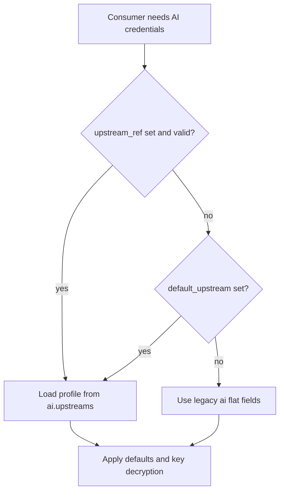

# AI Upstream Profiles (Design)

This document describes **named, reusable AI upstream profiles** for QuantMesh: goals, configuration shape, resolution rules, and migration. It is a blueprint for implementation; not every field may be wired up in the current release—refer to code and `CHANGELOG`.

## 1. Goals and scope

### 1.1 Goals

- Maintain **multiple** distinct credentials and endpoints in one `config.yaml` (e.g. office OpenAI, home Poe, regional gateway).
- Allow **feature-level** selection (news analysis, inspector, AI submodules) instead of a single global key/base URL.
- **Backward compatibility**: if new fields are unused, behavior matches historical flat `ai` configuration.

### 1.2 Non-goals (first iteration)

- **Automatic failover / rotation** across upstreams: defer to avoid coupling with async task retries and timeouts.
- **Restoring removed `ai.proxy.*`**: unless explicitly revived elsewhere; this design assumes direct access plus optional `base_url`.

## 2. Terminology

| Term | Meaning |
|------|---------|
| **Upstream** | One combination of provider + endpoint + credentials for an LLM call. |
| **Profile** | A key under `ai.upstreams` mapping to `provider`, `model`, `api_key`, `base_url`. |
| **Flat / legacy fields** | Top-level `ai.provider`, `ai.api_key`, `ai.gemini_api_key`, `ai.base_url`. |
| **upstream_ref** | A string referencing which profile a feature block uses. |
| **default_upstream** | Which `upstreams` key is the global default (optional). |

## 3. Current behavior (pre-implementation facts)

- Global `ai` exposes a single credential set (`config/config.go`).
- `news_monitor.ai_provider` can override; `ApplyDefaults` may inherit keys from global `ai`.
- `ai.NewAIClient(provider, model, apiKey, baseURL)` has no profile id; supported providers: `gemini`, `openai`, `claude`, `poe` (`ai/factory.go`).

## 4. Configuration shape

### 4.1 Suggested YAML

```yaml
ai:
  enabled: true

  default_upstream: ""

  upstreams:
    my-openai:
      provider: openai
      model: gpt-4o-mini
      api_key: "sk-..."
      base_url: ""

    office-poe:
      provider: poe
      model: "..."
      api_key: "..."
      base_url: "https://..."

  provider: gemini
  api_key: ""
  gemini_api_key: ""
  base_url: ""
```

### 4.2 Profile fields

| Field | Notes |
|-------|-------|
| `provider` | `gemini`, `openai`, `claude`, `poe` (factory). |
| `model` | Model name; empty defaults follow existing rules. |
| `api_key` | Same encryption/decryption path as global `ai` when applicable. |
| `base_url` | Custom API root; required for `poe`. Gemini may ignore until supported. |

## 5. Resolution rules

### 5.1 Output

Resolver should yield `provider, model, api_key, base_url` (or a struct) with keys decrypted when applicable.

### 5.2 No `upstreams`

- Ignore `default_upstream`.
- Behavior matches today’s flat fields and `news_monitor` inheritance.

### 5.3 With `upstreams`

1. If **`default_upstream` is set**: must reference a key in `upstreams`; defines global default credentials (exact merge rules with flat fields should be fixed in code + tests).
2. If **`default_upstream` is empty**: **recommended** convention—flat `ai.*` still acts as default; `upstreams` is used only when referenced by `upstream_ref` or explicit logic.

### 5.4 `upstream_ref`

If a module sets `upstream_ref` to an existing profile, **prefer** that profile’s tuple. Optional fallback if `api_key` is empty: document one strategy only (global flat vs `default_upstream` profile).

### 5.5 Flowchart



## 6. Per-feature bindings (planned fields)

| Consumer | Field | Notes |
|----------|-------|-------|
| Global default / Web | `ai.default_upstream` or flat `ai` | Align with `web/api.go` after central resolver. |
| `news_monitor` | `news_monitor.ai_provider.upstream_ref` | Prefer profile over duplicate inline keys when both exist. |
| `inspector` | `inspector.ai.upstream_ref` | Inspector-specific upstream. |
| `ai.modules.*` | per-module `upstream_ref` | e.g. market vs risk analysis. |

## 7. Security and observability

- Logs: may record **upstream id** and `provider`; never log raw `api_key`.
- Sanitize `upstreams.*.api_key` like flat keys in exports/APIs.
- Validate `default_upstream` and `upstream_ref` at startup or reload.

## 8. Gemini and `base_url`

Reserved for future custom endpoints; current `NewGeminiProvider` may ignore it—see implementation.

## 9. Migration

- **Flat-only users**: no change.
- **Multi-upstream**: add `upstreams`, optionally `default_upstream`, then set `upstream_ref` where needed; avoid duplicating secrets in flat + profiles without intent.

## 10. FAQ

**Q: Precedence between `default_upstream` and flat fields?**  
A: See §5.3; implementation must lock behavior with tests.

**Q: Same profile referenced from multiple features?**  
A: Supported.

**Q: Poe without `base_url`?**  
A: Factory error, same as today; validate early in config.

## 11. Implementation checklist

1. Extend `config.Config` with `default_upstream` and `upstreams`.
2. Wire `ApplyDefaults`, decrypt, sanitize.
3. Add `ResolveAIUpstream` (or equivalent).
4. Replace scattered reads in `main`, `web`, `monitor`, etc.
5. Tests for missing/invalid profiles.
6. WebUI types and i18n.

## See also

- [News monitor integration](../../news_monitor_integration.md)
- [Configuration guide](../../CONFIGURATION_GUIDE.md)
- Chinese full design: [AI_UPSTREAM_PROFILES.md](../../AI_UPSTREAM_PROFILES.md)

<!-- quantmesh usage beacon -->

